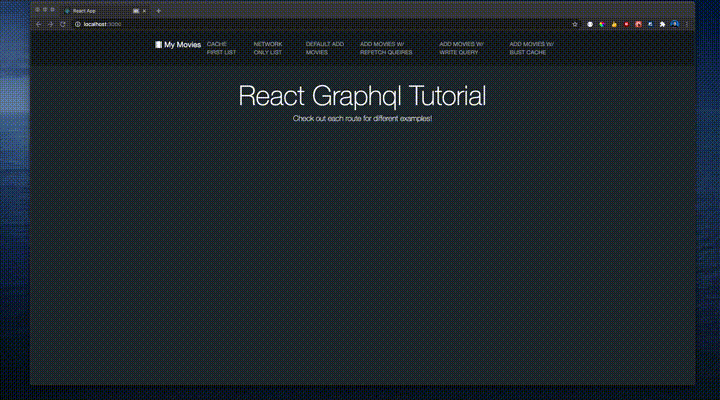
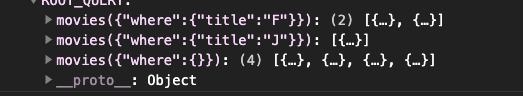

# Working with Apollo Cache

Over the past few years I've helped implement and maintain several GraphQL based stacks, and I've been very impressed with the features that Apollo has to offer both on the Frontend and Backend. From its declarative fetching, helpful tooling, extensive type definitions, and built-in integration with React, Apollo's Frontend client has played a fundamental role assisting with the architecture of the frontend code bases for these applications. Apollo also does a great job of maintaining a consistent in-memory cache that allows you to retrieve previously requested data without needing to make network request to the server. As a result, your application will feel much snappier and less bogged down by loading wheels. Apollo even provides ways of warming up the cache to be used for later.

However there are imperfections with the tool as with any. One notoriously difficult issue is trying to update or bust the cache after server-side updates, especially when the queries being cached have many filters and constraints. The difficulty lies in how apollo caches the result of each query. Let's use the following query for a list of movies as an example

```
useQuery(FETCH_MOVIES, { variables: { title: input } })
```

This query will retrieve a collection of movie records and accepts a `title` variable to filter the list down. Each time the `title` filter is updated, Apollo will store that query in it's cache individually.

Throughout this article we'll be using this Mock Movie List application as a reference.



Now when it comes time to update the cache, it becomes increasingly difficult to determine which queries to update without resorting to refetching them all. Because of these difficulties, Apollo provides multiple ways to update the cache depending on the needs to your application.

## Fetch Policies

The easiest work around by far is updating the `fetchPolicy` for your query. The following are the list of fetch policies that you can specify for your query. For the purpose of this article we'll only be discussing the first three as they are more likely to be used

```
cache-first | cache-and-network | network-only | no-cache | cache-only
```

### `cache-first`

This is the default. Apollo will first look in the cache to see if there is a query matching the name / filters, then retrieve it, otherwise it will make a network request. The imperfection with this method lies with its inability to recognize server-side changes to the data. You will have to manually modify the cache using a different Apollo method to have the query reflect any updates.

<-- GIF OF CACHE-FIRST EXAMPLE -->

### `cache-and-network`

This query initially behaves the same as `cache-first`, but even if Apollo does locate an existing result in the cache store, it will still make a network request in the background. For many simple applications this will be enough. However for larger more complex apps with very expensive queries, this may not be a suitable solution as Apollo will always be making a query in the background and that can cause performance issue for the frontend.

<-- GIF OF CACHE-AND-NETWORK EXAMPLE -->

### `network-only`

Apollo will bypass the cache and always make a network request. However it will still store the result of the request in the cache incase the same query with a different fetch policy is being made elsewhere in the application. This is the easiest solution to making sure your app will always have the most up to date data. The problem is we've now bypassed the caching feature and will lose out on that snappy feeling and will end up having to show loading wheels more often through out the app. Depending on your client's needs, this may not be acceptable.

<-- GIF OF NETWORK-ONLY EXAMPLE -->

## Refetch Queries

```
useMutation(CREATE_MOVIES, { refetchQueries: [{ query: FETCH_MOVIES }] })
```

Apollo provides us with yet another convenient way of updating it's query store via `refetchQueries`. You can pass it an array of operation names or an array of query objs. As soon as it completes the mutation, Apollo will go and refetch the entire list of queries passed in.

This is not ideal for two reasons.

1. If your query contains variables, you need to specify those exact variables in order for Apollo to correctly update the correct cache record. How could you possibly know how many cache records are in the store and how many need to be updated based on the mutation that was made?

```
useQuery(FETCH_MOVIES, { variables: { title: 'Jurrasic' } })

useMutation(CREATE_MOVIES, { refetchQueries: [{ query: FETCH_MOVIES, { variables: { title: 'Jurrasic' } } }] })
```

2. Let's assume that you were able to determine exactly which queries needed to be updated and all the possible filter permutations. This will result in n-number of network requests being sent out. If you had pagination filters and hundreds of pages of results, then you will have hundreds of network requests being fired.

<-- GIF OF REFETCH QUERIES AND MULTIPLE NETWORK REQUESTS -->

## Writing to the Cache (Optimistic UI)

Another handy tool that Apollo provides us is a way to simulate the results of a mutation and update the UI before even receiving a response from the server. In doing so, you will write directly to the Apollo cache store and update the query results. When the results do eventually populate, the optimistic result will be replaced by the actual result. Also if the mutation were to fail, the optimistic result will also be discarded.

```
useMutation(CREATE_MOVIES, {
  update: (cache, mutationResult) => {
    const optimisticResult = mutationResult.data.createMovie;

    const data = cache.readQuery({ query: FETCH_MOVIES, variables: {...} });

    proxy.writeQuery({
      query: FETCH_MOVIES,
      variables: {...},
      data: { movies: [...data.movies, optimisticResult] }
    })
  }
})
```

The `update` callback will be triggered after the mutation has finished. The first argument supplied will be the apollo cache instance, and the second will be the mutation result object.

The cache instance is capable of reading the result of any existing query in the store via `readQuery`. **It is important to note that this read throw an error if no results are found**. This is less than ideal because similar to `refetchQueries`, you need to supply the query with the exact variables you want to update. The same issue exists where you may not know how many permutation exists for the query variables. For the movie "Frozen", Apollo could have cached "F", "Fr", "Fro", "Froz", "Froze", and "Frozen" all individually depending on how the UI allows the user to search.

`writeQuery` is how you can manipulate the result of the store. The `data` property will replace the existing query result for that cache record.

Another pitfall with this method is you may not always know the result of the mutation therefore an optimisitc result cannot be inferred. If the data that the frontend works with gets massaged by several middleware layers before getting persisted, it may look entirely different.

<-- GIF OF WRITING TO CACHE -->

## Busting the Cache

The last method we'll be discussing is the more esoteric of the bunch, but has worked the best for me personally. In addition to being able to read / write to the apollo cache, you can also delete specific cache keys. By deleting specific cache records, Apollo will be forced to refetch only those queries. This is more ideal than changing the network policy because it doesn't force the query to be re-fetched everytime your component re-mounts, just when the relevant mutation fires off. It's also preferable over `refetchQueries` and `writeQuery` because you can single out keys based on a string match, you no longer need to determine the different variables that has to be updated, nor will you end up firing off hundreds of queries all at once.

```
useMutation(CREATE_MOVIE, {
    update: cache => {
      const cacheKeys = Object.keys(cache.data.data);

      cacheKeys.forEach(key => key.includes('movies') && cache.data.delete(key));
    },
})
```



As you can see the pattern for the cache keys will be the name of the query followed by a unique number identifier. Therefore we can simply invalidate the cache keys based on the name of the query.

<-- GIF OF BUSTING CACHE -->

## Conclusion

To wrap things out, I just want to point out that none of these solutions are "perfect". You will likely need to play around with a few of them to determine which one best suits your application. Hopefully in the future Apollo will provide us with better ways to overcome these challenges, but until then, I hope you'll find this to be helpful!
